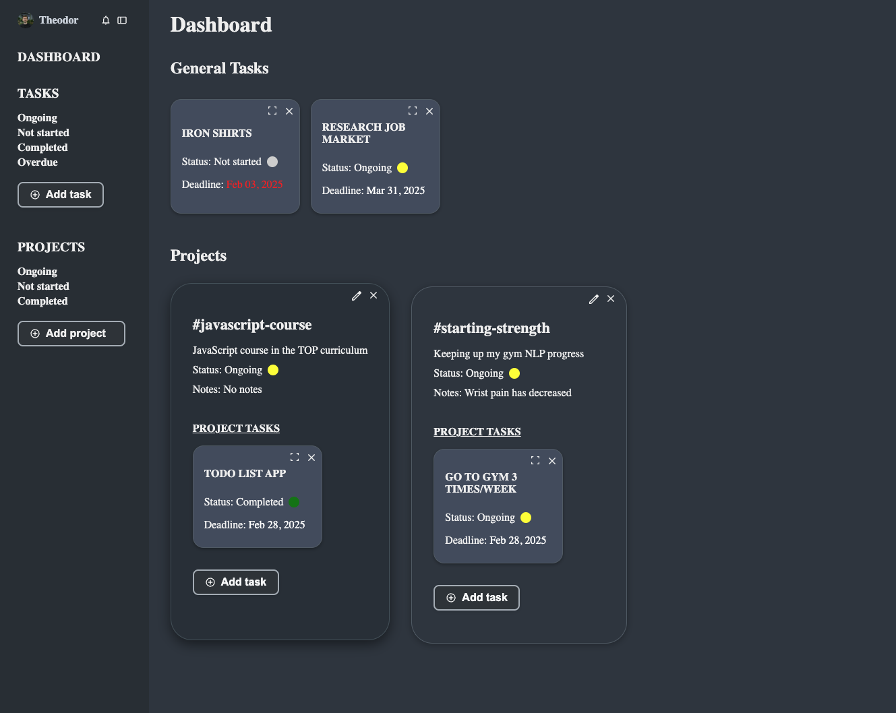

## TodoList App

Live version: https://theografiska.github.io/todoapp/

### Main Functionality

The app is a simple project and task management tool that allows users to create and manage projects and associated tasks. The main functionality includes:

1. Project Creation and Management:

Users can create new projects by filling out a form with project details (title, description, status, notes).
Each project is stored in an array and can be rendered dynamically on the page.
Projects are displayed as cards with details such as title, description, status, and notes.

2. Task Management:

Each project can have tasks associated with it.
Users can add new tasks to a project and view them as smaller task cards within the project.
Tasks can be deleted from the project.

3. UI Features:

The app uses modal dialogs for creating new projects.
A task area is provided under each project, displaying the tasks associated with that project.
An "Add Task" button is available for each project, which opens the task creation interface.
Edit and delete buttons allow users to modify or remove projects as needed.

4. Data Persistence:

Projects are stored in the browser's local storage, ensuring data persists across page reloads.
Overall, the app provides a way for users to organize their projects, manage tasks within them, and easily navigate between different projects.